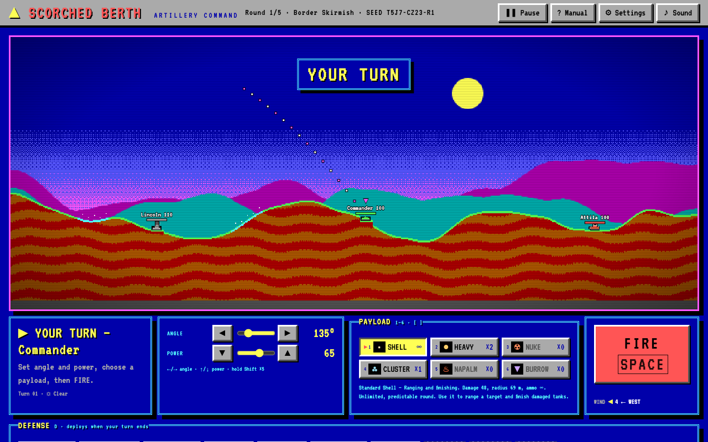
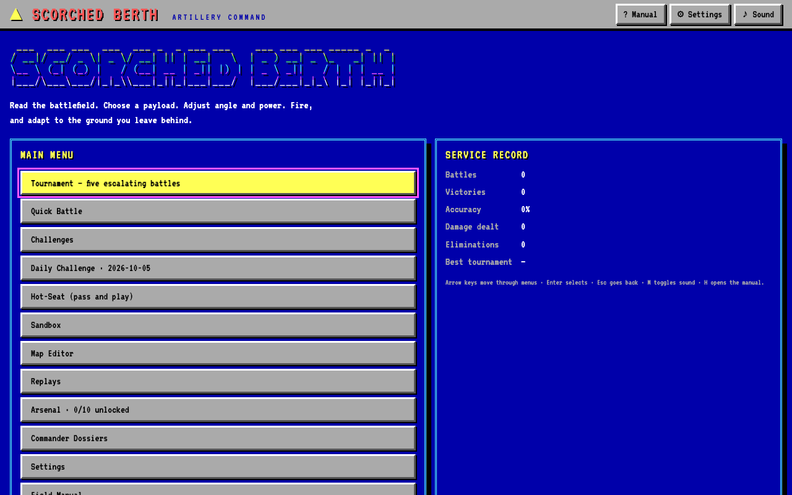
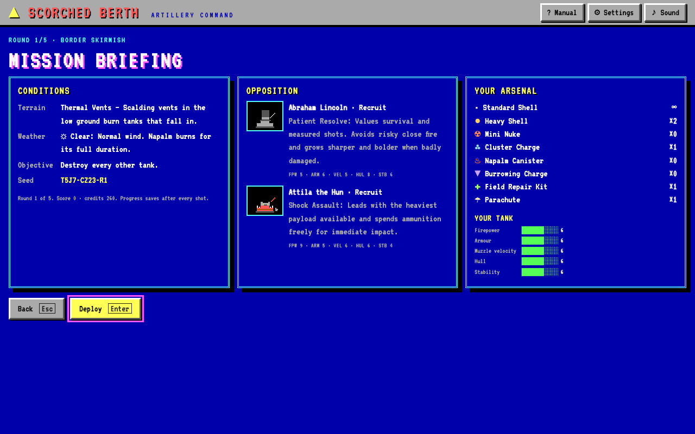
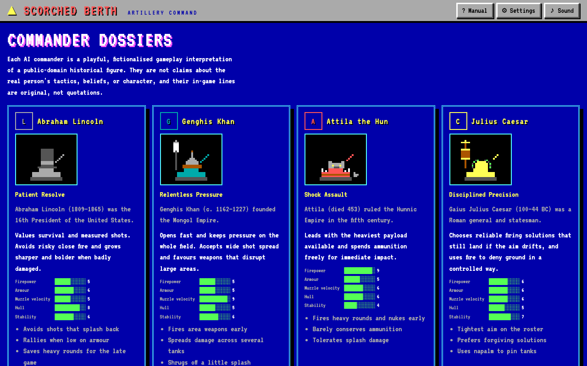
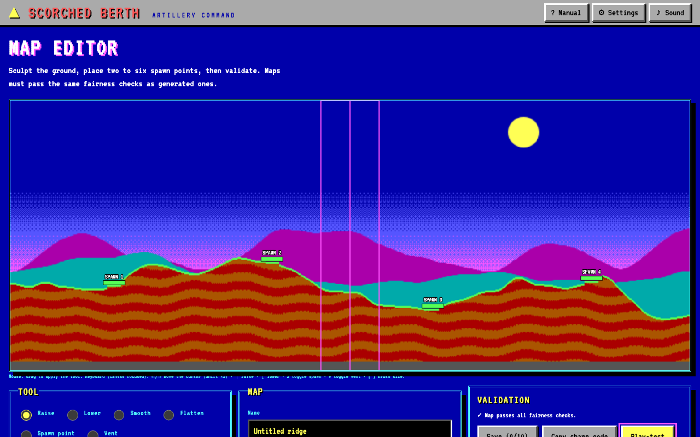

# Scorched Berth

A turn-based browser artillery game in the spirit of 1990s DOS shareware. Read the battlefield, choose a payload, set angle and power, fire, and adapt to the ground you leave behind. Built with vanilla JavaScript, Canvas, CSS, and Vite. There are no runtime dependencies, and nothing needs a server.



## Screenshots

| | |
| --- | --- |
|  |  |
| Title screen and service record | Mission briefing before a tournament round |
|  |  |
| Commander dossiers | Map editor |

## Run

```sh
npm install
npm run dev        # local development server
npm run build      # production build in dist/
npm run preview    # serve the production build
npm run build:single  # the whole game in one file: standalone/scorched-berth.html
```

### Single-file version

`standalone/scorched-berth.html` is the complete game in one self-contained HTML file: the bundled script and stylesheet are inlined. Double-click it to play from disk, email it, or drop it on any static host. Only the two fonts load from Google Fonts, and the game falls back to system monospace fonts when offline.

It is published to GitHub Pages at https://themightymo.github.io/scorched-berth/ by `.github/workflows/pages.yml` whenever a push to `main` changes it.

It is rebuilt automatically. `npm install` points git at the versioned hooks in `.githooks/`, and the pre-commit hook rebuilds the file and adds it to any commit that touches the app (`src/`, `index.html`, `style.css`, `main.js`, `package.json`). Every push therefore carries a current copy. To skip it once, run `SKIP_SINGLE_BUILD=1 git commit …`. If you cloned without running `npm install`, enable the hook with `git config core.hooksPath .githooks`.

## Verify

```sh
npm test           # all unit and behaviour tests (node:test, no browser)
npm run simulate   # 100 seeded AI-only battles: timing, failures, commander behaviour
npm run verify     # tests + simulation + production build + single-file build (use before shipping)
npm run smoke      # optional: end-to-end checks in headless Chrome (run `npm run build` first; set CHROME_PATH if Chrome is not in the default macOS location)
```

Add `?dev=1` to the URL to show the AI diagnostics overlay (target, score, predicted impact, decision time), unlock every weapon for that session, and expose `window.__sb` for debugging. `?unlockall` unlocks the weapons without the overlay. Neither changes your saved record. Normal play never shows diagnostics.

## Modes

- **Tournament**: five escalating battles against the historical commanders. You earn credits for damage, eliminations, survival, and victory, and a defeat always pays at least 170. Spend credits in the armory between rounds. Progress saves after every shot; reloading resumes exactly where you left off. After a defeat, **Continue** keeps the result and its credits; **Retry** replays the round from its start for −250 score.
- **Quick Battle**: pick the terrain, weather, night, seed, and up to five AI commanders with difficulty levels.
- **Challenges**: six data-defined scenarios (range finding, crosswind, burrowing, napalm, survival, a night duel), each with up to three stars.
- **Daily Challenge**: the same seeded battlefield for everyone on a given date. The best score is stored on this device only.
- **Hot-Seat**: two to four people share one keyboard. A hand-off screen hides each player's aim and arsenal, and each player shops in a private armory between rounds.
- **Sandbox**: change gravity, wind, starting armour, the turn limit, wall rebounds, unlimited ammunition, and the starting arsenal. Results are not recorded.
- **Map Editor**: sculpt terrain, place two to six spawns and thermal vents, validate against the same fairness rules as generated maps, save locally, share as a code, and play-test.
- **Replays**: the last 12 battles are stored as seed + commands. Playback re-simulates every shot and confirms the result matches. Replays can be shared as text codes.

## Controls

| Key | Action |
| --- | --- |
| ← / → | Angle ±1° (Shift: ±5°). Left raises the barrel toward the left. |
| ↑ / ↓ | Power ±1 (Shift: ±5) |
| 1–9, 0, [ / ] | Choose payload (0 is the tenth; [ ] cycles through the rest) |
| D | Cycle the defense to deploy when this turn ends |
| Space, Enter, F | Fire |
| P, Esc | Pause / resume (freezes shots in flight and AI turns) |
| S | Cycle battle speed: ×1, ×2, ×3 |
| H, ? | Field manual |
| M | Mute |
| K | Kibitz (you will be told off) |
| ↑/↓, Enter, Esc | Navigate menus, confirm, go back |

Every control also works with the mouse. Page scrolling is blocked only while gameplay keys are active. Hiding the tab pauses the battle.

## Rules

- 90° fires straight up; below 90° fires right, above 90° fires left.
- **Wind** pushes every projectile sideways at a steady rate. It shifts a little after every turn, more in a gale. The trajectory preview is set in Settings: Full draws the whole arc with wind, Partial (the default) draws the first third in still air so you must judge the wind, and Off draws nothing. With Partial or Off, a faint trail and an ✕ show where your previous shot landed.
- **Damage** falls off linearly to zero at the blast radius. A direct hit deals full damage. Craters reshape the ground. Tanks fall when the ground beneath them is removed, and a fall of more than 20 m causes damage, applied once per fall.
- **Payloads**: Standard Shell (unlimited), Heavy Shell, Mini Nuke, Cluster Charge (splits into five at the top of its arc), Napalm Canister (fire burns tanks at the end of each turn; blasts put it out; rain weakens it), and Burrowing Charge (drills before detonating; its shaft drops tanks above it). The field manual and armory list each payload's role and counterplay.
- **Classic arsenal**: Missile, Nuke, Death's Head, Napalm, Hot Napalm, Riot Charge, and Heavy Riot Bomb are joined by nine more payloads. Ten advanced weapons are earned from your service record. The **Arsenal** screen on the title menu shows each goal and your progress, and the debrief announces new unlocks. Once a weapon is unlocked, quick battles, hot-seat series, and map play-tests issue starting rounds, the tournament armory sells it, and sandbox lets you stock it. Daily and challenge battles keep their fixed arsenals. Sandbox and play-test battles do not count toward unlocks.
- **Classic accessories**: Parachutes open automatically; Heavy Shields absorb blast damage; Batteries restore armour; and Fuel moves a tank in the direction of its barrel after firing.

  | Weapon | Unlock | What it does |
  | --- | --- | --- |
  | ≈ Leapfrog | Win 3 battles | Explodes, then hops onward twice; each hop is weaker. |
  | ◌ Riot Bomb | Fire 75 shots | Enormous crater, no blast damage: drop a tank into the pit or dig yourself out. |
  | ▲ Ton O' Dirt | Fight 10 battles | Drops a huge ball of earth. A tank caught in it sits in a pit and must fire steeply or blast free. |
  | ♨ Hot Napalm | Deal 250 burn damage with fire | Wider, hotter, longer-lasting napalm. |
  | ⌁ Laser | Land 10 direct hits | Straight beam with no gravity or wind; power sets its range; hills block it. |
  | ◉ Heavy Roller | Earn 6 challenge stars | Lands, rolls downhill, and explodes at a tank or the valley floor. |
  | ⋔ Heavy Sandhog | Destroy 12 enemy tanks | Burrows and forks into three tunnelling warheads. |
  | ✺ Funky Bomb | Win a Daily Challenge | Bursts and flings six multicoloured bomblets in a wild spray. |
  | ✹ Plasma Blast | Complete a tournament | Discharges around your own tank without hurting you. Power sets its size, and a tighter blast hits harder. |
  | ☠ Death's Head | Score 3,200 in one tournament (Major rank) | Nine heavy warheads split at the top of the arc. |

  Unlocks are derived from the service record rather than stored separately, so they can never get out of sync with it. The rules live in `src/game/unlocks.js`.
- **Defenses**: ten items sold in the armory beside the payloads. **Active** defenses are chosen during your turn (one per turn, click again or cycle with D to clear) and deploy when the turn ends, after your own shot lands: Energy Shield (absorbs the next 60 blast damage), Deflector Field (bounces the first hostile projectile away and the bounced round counts as yours), Field Repair Kit (+35 armour), Fire Suppressant (puts out fires within 100 m and gives fire and vent immunity for two rounds), Earthworks (dirt berms on both sides), Bedrock Anchor (craters cannot dig out the ground beneath you for two rounds), and Emergency Relocator (warps you to a random spot clear of other tanks). **Automatic** defenses trigger by themselves: Point-Defense Gun (shoots down the first hostile projectile within 80 m, one charge each), Parachute (prevents one fall's damage), and Hull Plating (+25 armour at the start of the next battle). Defenses always use up stock, even with unlimited ammunition. AI commanders carry defenses in later tournament rounds and use them by doctrine.
- **Weather**: Clear, Gale (strong, shifting wind), or Rain (weaker napalm). **Night** limits the preview to Partial and widens every AI's aim.
- **Thermal vents** (Thermal Vents terrain) burn tanks that end a turn on them. Tanks never spawn near one.

### Stat ratings

Every tank has a trading-card style stat block rated 2–10 in five categories, with the same 30-point budget for everyone, so each strength costs a weakness:

| Rating | Effect |
| --- | --- |
| Firepower | Damage dealt by blasts and fire (±4% per point from 6) |
| Armour | Damage taken from blasts, fire, and vents (∓4% per point) |
| Muzzle velocity | Shell launch speed: more range and less wind drift (±2.5% per point) |
| Hull | Maximum armour points (±5% per point) |
| Stability | Fall damage (∓8% per point) |

Each commander has a fixed card (see Commander Dossiers). Players choose a chassis in Settings (Standard, Striker, Bulwark, Longshot, Mountaineer); a tournament keeps the chassis it started with. Ratings are separate from AI difficulty, which never changes armour or damage.

## Commanders

Six AI commanders are playful, fictionalised gameplay interpretations of public-domain historical figures: Abraham Lincoln, Genghis Khan, Attila the Hun, Julius Caesar, Napoleon Bonaparte, and Queen Elizabeth I. They are not claims about the real people's tactics, beliefs, or character, and their in-game lines are original, not quotations. Each commander drives a tank that says who is inside: Lincoln's turret wears a tall stovepipe hat, Napoleon's a bicorne with a tricolour cockade, Elizabeth's a jewelled crown on a lace ruff, Caesar's a laurel-ringed golden helm with an eagle standard at the rear, Genghis Khan's a fur-trimmed spiked helmet with a horsetail standard, and Attila's a wolf-pelt helm with bone spikes and an iron ram. A destroyed commander leaves its keepsake beside the wreck. Tanks talk: now and then a tank cracks a line in character as it fires (about one shot in three), and every destroyed tank gets last words, picked at random from at least ten per commander (human tanks have their own set). The lines live in each commander's `barks` in `src/ai/commanders.js`. The sprites are in `src/ui/sprites.js` and also appear as portraits in the dossiers and briefing. Each commander's doctrine is data in `src/ai/commanders.js`: target priorities, weapon preferences, risk tolerance, terrain weighting, aim variance, patience, ammunition conservation, and stat ratings. Difficulty (Recruit, Veteran, Ace) changes only search density, aim spread, and memory.

## Architecture

```
src/core/   deterministic simulation: no DOM, no Math.random, no timers
  engine.js     battle state, commands, fixed-tick step, damage, craters, falls, fire, turn order, outcomes, replay
  physics.js    projectile launch/step/trace shared by live shots, preview, AI, and map validation
  weapons.js    validated weapon registry (UI, help, armory, firing, and AI all read it) and shared inventory helpers
  defenses.js   validated defense registry (active and automatic equipment)
  ratings.js    stat ratings, chassis, and their mechanical multipliers
  mapgen.js     seeded fair map generator with bounded retries and a safe fallback
  terrain.js, rng.js, math.js (series-based trig for cross-browser determinism), weather.js, clock.js (fixed-step driver)
src/ai/     shared candidate-shot evaluator (ai.js), commander data (commanders.js), batch simulation (batch.js)
src/game/   state machine, versioned storage, settings, themes, economy, tournament, records, unlocks, replays, map format, challenges
src/ui/     app controller, canvas renderer, commander tank sprites, effects, synthesised audio, battle log, screens, map editor
tests/      node:test suites for engine, rules, AI, and game layer
scripts/    simulate.mjs (AI batch report), build-single.mjs (single-file build), browser-smoke.mjs + cdp.mjs (optional headless Chrome checks)
.githooks/  pre-commit: rebuilds standalone/scorched-berth.html
```

- The simulation runs on a fixed 200 Hz tick, independent of frame rate and display size. Rendering reads state; effects and sounds react to engine events and never feed back.
- Battles are fully determined by `config` (seed, players, rules) plus the list of `fire` commands. That one property drives replays, tournament resume after reload, and AI what-if simulation.
- The AI traces real trajectories, resolves its best candidates on a copy of the battle through the real engine, and stops before the turn ends, so it can never see future randomness. Each decision has a time budget and a deterministic legal fallback.
- Every app screen and battle sub-state is listed in `src/game/machine.js` with its legal transitions.

## Saved data

All data lives in `localStorage` under `scorched-berth.*` keys: `settings`, `tournament`, `records`, `replays`, `maps`. Each document is versioned (`v: 1`) and sanitised on load. Unreadable, corrupt, or newer-version data is copied to `<key>.backup` before the game falls back to defaults, and the title screen shows a notice. Legacy unversioned settings are migrated. Tournament rewards are keyed by battle id, so reloading, retrying, or double-clicking can never apply them twice.

## Assets and fonts

All art is drawn procedurally and all sound is synthesised at runtime; there are no image or audio files. Fonts (VT323 and IBM Plex Mono, both under the SIL Open Font License) load from Google Fonts with local monospace fallbacks. Gameplay needs no network access.

## Not included

Online multiplayer and online leaderboards need a trusted backend. See [docs/online-design.md](docs/online-design.md) for the proposed design and the decisions it needs.
